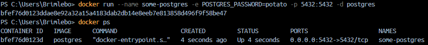

# DAT250 Experiment Assignment 7 - report

No real issues this time in task 1 other than figuring out how to get the correct ports from the container.

Considering I had both the backend and frontend in the same directory/repository it ended up with dockerizing both of them at the same time.
Because of this I ended up using VITE_BACKEND_URL=http://backend:8080 in the docker-compose file in order to allow the frontend and backend to communicate while they are in a container.

That was the plan, but for reasons I couldn't find out the containers wouldn't communicate with each other and when I attempt to open the site on the localhost I would get no response.
It worked well enough when I run it from my IDE and I couldn't find the cause of the lack of communication, I assume it has something to do with the ports the containers output to. 

Running the docker-compose build in the root folder of [this repository](https://github.com/brimlebo/DAT-250-experiments) will give you both the frontend and backend containers in a network.
I would appreciate any tips or comments on how to fix this if there is anything you can spot.

### Starting the container
* Had to bind default port in order to connect to it

### Dockerized application
[Link to commit for dockerization](https://github.com/brimlebo/DAT-250-experiments/commit/951fbcf871ceb1aa6e1f10e5596942b031edd855)

